---
## Front matter
lang: ru-RU
title: Лабораторная работа №2
subtitle: Операционные системы
author:
  - Малюга В. В.
institute:
  - Российский университет дружбы народов, Москва, Россия
date: 1 марта 2024

## i18n babel
babel-lang: russian
babel-otherlangs: english

## Formatting pdf
toc: false
toc-title: Содержание
slide_level: 2
aspectratio: 169
section-titles: true
theme: metropolis
header-includes:
 - \metroset{progressbar=frametitle,sectionpage=progressbar,numbering=fraction}
 - '\makeatletter'
 - '\beamer@ignorenonframefalse'
 - '\makeatother'
---

## Цель работы

  Изучить идеологию и применение средств контроля версий.  
  Освоить умения по работе с git.  

## Задание

1. Создать базовую конфигурацию для работы с git.  
2. Создать ключ SSH.  
3. Создать ключ PGP.  
4. Настроить подписи git.  
5. Зарегистрироваться на Github.  
6. Создать локальный каталог для выполнения заданий по предмету.  
                                                                                                  
                                                                                                  
## Выполнение лабораторной работы. Создание базовой конфигурации для работы с git  

  Установила git (рис. 1), gh (рис. 2).  
  
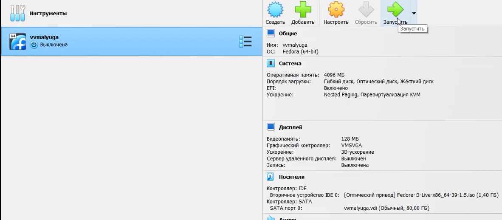{#fig:001 width=70%}

## Выполнение лабораторной работы. Создание базовой конфигурации для работы с git  

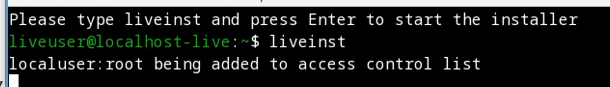{#fig:002 width=70%}

## Выполнение лабораторной работы. Создание базовой конфигурации для работы с git  
  
  Задала имя, email владельца репозитория, настроила utf-8 в выводе сообщений git, задала имя начальной ветки, параметры autocrlf и safecrlf (рис. 3).  
  
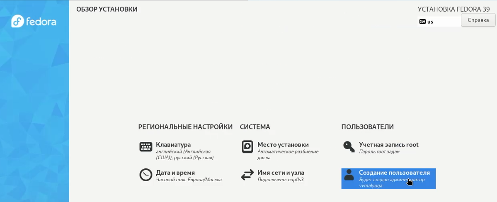{#fig:003 width=70%}

## Выполнение лабораторной работы. Создание ключа SSH и PGP

  Создала ключи ssh по алгоритму rsa с ключём размером 4096 бит и по алгоритму ed25519 (рис. 4). Создала ключи pgp по предложенным опциям (рис. 5).  
  
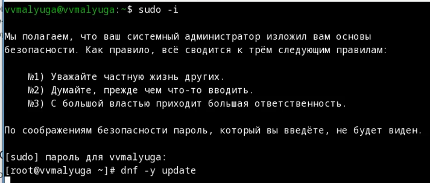{#fig:004 width=70%}

## Выполнение лабораторной работы. Создание ключа SSH и PGP

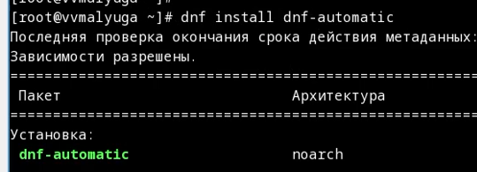{#fig:005 width=70%}

## Выполнение лабораторной работы. Создание ключа SSH и PGP

  Вывела список ключей (рис. 6), затем вывела gpg ключ (рис. 7). Скопировала его, и авторизовала в гитхабе (рис. 8).  

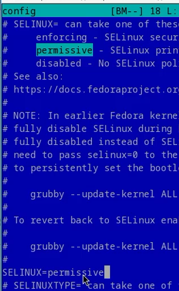{#fig:006 width=70%}

## Выполнение лабораторной работы. Создание ключа SSH и PGP

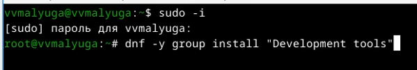{#fig:007 width=70%}

## Выполнение лабораторной работы. Создание ключа SSH и PGP

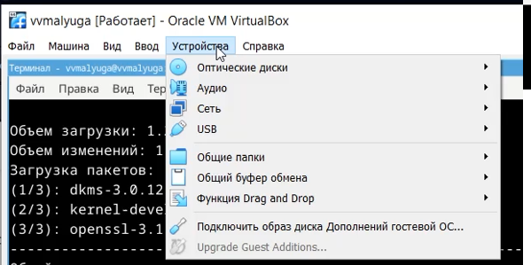{#fig:008 width=70%}

## Выполнение лабораторной работы. Настройка подписи git

  Используя введёный email, указала Git применять его при подписи коммитов (рис. 9).  

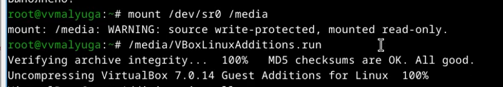{#fig:009 width=70%}

## Выполнение лабораторной работы. Настройка gh 

  Авторизовала gh (рис. 10).  

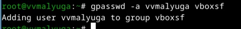{#fig:010 width=70%}

## Выполнение лабораторной работы. Создание репозитория курса на основе шаблона

  Создала репозиторий курса на основе шаблона (рис. 11) и (рис. 12).  

{#fig:011 width=70%}

## Выполнение лабораторной работы. Создание репозитория курса на основе шаблона

{#fig:012 width=70%}

## Выполнение лабораторной работы. Создание репозитория курса на основе шаблона
  
  Отправила файлы на сервер (рис. 13) и (рис. 14).  
  
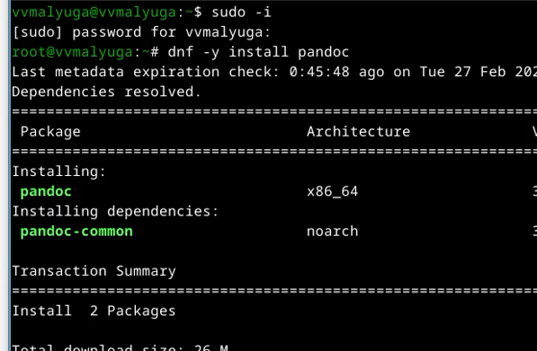{#fig:013 width=70%}  

## Выполнение лабораторной работы. Создание репозитория курса на основе шаблона

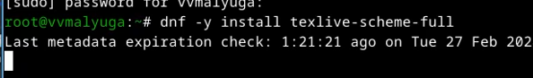{#fig:014 width=70%}

## Выводы

  Изучила идеологию и применение средств контроля версий, освоила умения по работе с git.
