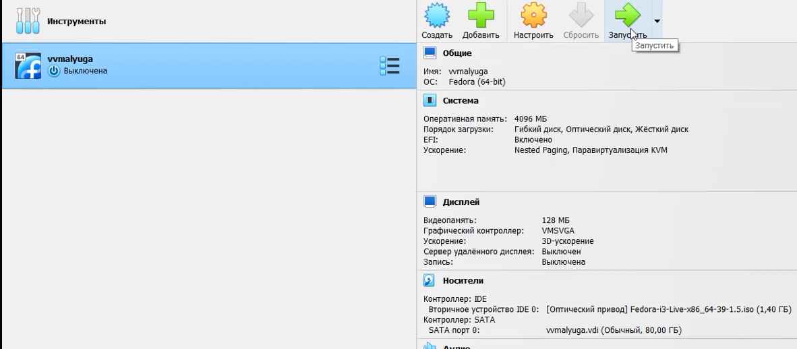
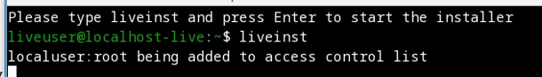
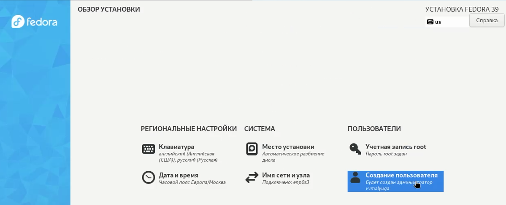
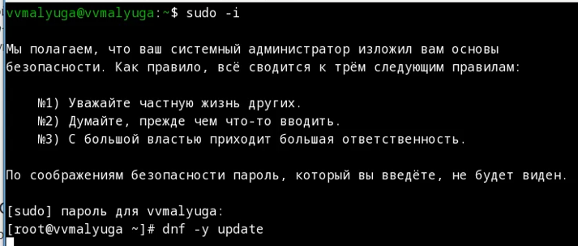
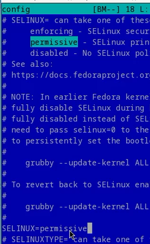

---
## Front matter
title: "Отчет по лабораторной работе №1"
subtitle: "Операционные системы"
author: "Малюга Валерия Васильевна"

## Generic otions
lang: ru-RU
toc-title: "Содержание"

## Bibliography
bibliography: bib/cite.bib
csl: pandoc/csl/gost-r-7-0-5-2008-numeric.csl

## Pdf output format
toc: true # Table of contents
toc-depth: 2
lof: true # List of figures
lot: true # List of tables
fontsize: 12pt
linestretch: 1.5
papersize: a4
documentclass: scrreprt
## I18n polyglossia
polyglossia-lang:
  name: russian
  options:
	- spelling=modern
	- babelshorthands=true
polyglossia-otherlangs:
  name: english
## I18n babel
babel-lang: russian
babel-otherlangs: english
## Fonts
mainfont: PT Serif
romanfont: PT Serif
sansfont: PT Sans
monofont: PT Mono
mainfontoptions: Ligatures=TeX
romanfontoptions: Ligatures=TeX
sansfontoptions: Ligatures=TeX,Scale=MatchLowercase
monofontoptions: Scale=MatchLowercase,Scale=0.9
## Biblatex
biblatex: true
biblio-style: "gost-numeric"
biblatexoptions:
  - parentracker=true
  - backend=biber
  - hyperref=auto
  - language=auto
  - autolang=other*
  - citestyle=gost-numeric
## Pandoc-crossref LaTeX customization
figureTitle: "Рис."
tableTitle: "Таблица"
listingTitle: "Листинг"
lofTitle: "Список иллюстраций"
lotTitle: "Список таблиц"
lolTitle: "Листинги"
## Misc options
indent: true
header-includes:
  - \usepackage{indentfirst}
  - \usepackage{float} # keep figures where there are in the text
  - \floatplacement{figure}{H} # keep figures where there are in the text
---

# Цель работы

Целью данной работы является приобретение практических навыков установки операционной системы на виртуальную машину, настройки минимально необходимых для дальнейшей работы сервисов.

# Задание

1. Создание виртуальной машины
2. Запуск приложения для установки системы
3. Установка системы на диск
4. Обновление
5. Установка драйверов для VirtualBox

# Выполнение лабораторной работы

## Создание виртуальной машины

 Согласно всем необходимым параметрам создала виртуальную машину (рис. [-@fig:001]).  

{#fig:001 width=70%}

## Запуск приложения для установки системы

  Загрузила LiveCD, появился интерфейс начальной конфигурации. Нажала Enter для создания конфигурации по умолчанию. Нажала Enter, чтобы выбрать в качестве модификатора клавишу Win. В терминале запустила liveinst (рис. [-@fig:002]).  

{#fig:002 width=70%}

## Установка системы на диск

  Выбрала язык интерфейса и перешла к настройкам установки операционной системы. Место установки ОС оставила без изменения. Установила имя и пароль для пользователя root. Установила имя и пароль для пользователя. Задала сетевое имя компьютера (рис. [-@fig:003]).  

{#fig:003 width=70%}

## Обновление

  Обновила все пакеты (рис. [-@fig:004]).  

{#fig:004 width=70%}

  В файле /etc/selinux/config заменила значение SELINUX=enforcing на значение SELINUX=permissive  (рис. [-@fig:006).  

{#fig:006 width=70%}

## Установка драйверов для VirtualBox

Установите пакет DKMS:

dnf -y install dkms
В меню виртуальной машины подключите образ диска дополнений гостевой ОС.
Подмонтируйте диск:

mount /dev/sr0 /media
Установите драйвера:

/media/VBoxLinuxAdditions.run
Перегрузите виртуальную машину:

Внутри виртуальной машины добавьте своего пользователя в группу vboxsf (вместо username укажите ваш логин):

gpasswd -a username vboxsf
В хостовой системе подключите разделяемую папку:

vboxmanage sharedfolder add "$(id -un)_os-intro" --name=work --hostpath=work --automount
Перегрузите виртуальную машину:

reboot

Средство pandoc для работы с языком разметки Markdown.
Установка с помощью менеджера пакетов:

dnf -y install pandoc

Дождитесь загрузки графического окружения и откройте терминал. В окне терминала проанализируйте последовательность загрузки системы, выполнив команду dmesg. Можно просто просмотреть вывод этой команды:

dmesg | less
Можно использовать поиск с помощью grep:

dmesg | grep -i "то, что ищем"
Получите следующую информацию.
Версия ядра Linux (Linux version).
Частота процессора (Detected Mhz processor).
Модель процессора (CPU0).
Объём доступной оперативной памяти (Memory available).
Тип обнаруженного гипервизора (Hypervisor detected).
Тип файловой системы корневого раздела.
Последовательность монтирования файловых систем.

# Выводы

Здесь кратко описываются итоги проделанной работы.

