---
## Front matter
title: "Отчет по лабораторной работе №2"
subtitle: "Операционные системы"
author: "Малюга Валерия Васильевна"

## Generic otions
lang: ru-RU
toc-title: "Содержание"

## Bibliography
bibliography: bib/cite.bib
csl: pandoc/csl/gost-r-7-0-5-2008-numeric.csl

## Pdf output format
toc: true # Table of contents
toc-depth: 2
lof: true # List of figures
fontsize: 12pt
linestretch: 1.5
papersize: a4
documentclass: scrreprt
## I18n polyglossia
polyglossia-lang:
  name: russian
  options:
	- spelling=modern
	- babelshorthands=true
polyglossia-otherlangs:
  name: english
## I18n babel
babel-lang: russian
babel-otherlangs: english
## Fonts
mainfont: PT Serif
romanfont: PT Serif
sansfont: PT Sans
monofont: PT Mono
mainfontoptions: Ligatures=TeX
romanfontoptions: Ligatures=TeX
sansfontoptions: Ligatures=TeX,Scale=MatchLowercase
monofontoptions: Scale=MatchLowercase,Scale=0.9
## Biblatex
biblatex: true
biblio-style: "gost-numeric"
biblatexoptions:
  - parentracker=true
  - backend=biber
  - hyperref=auto
  - language=auto
  - autolang=other*
  - citestyle=gost-numeric
## Pandoc-crossref LaTeX customization
figureTitle: "Рис."
tableTitle: "Таблица"
listingTitle: "Листинг"
lofTitle: "Список иллюстраций"
lolTitle: "Листинги"
## Misc options
indent: true
header-includes:
  - \usepackage{indentfirst}
  - \usepackage{float} # keep figures where there are in the text
  - \floatplacement{figure}{H} # keep figures where there are in the text
---

# Цель работы

Изучить идеологию и применение средств контроля версий.
Освоить умения по работе с git.

# Задание

Создать базовую конфигурацию для работы с git.  
Создать ключ SSH.  
Создать ключ PGP.  
Настроить подписи git.  
Зарегистрироваться на Github.  
Создать локальный каталог для выполнения заданий по предмету.  
                                                                                                  |

# Выполнение лабораторной работы

## Создание базовой конфигурации для работы с git 

  Установила git (рис. [-@fig:001]), gh (рис. [-@fig:002]).  
  
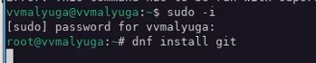{#fig:001 width=70%}

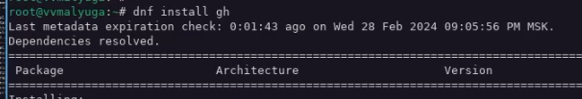{#fig:002 width=70%}
  
  Задала имя, email владельца репозитория, настроила utf-8 в выводе сообщений git, задала имя начальной ветки, параметры autocrlf и safecrlf (рис. [-@fig:003]).  
  
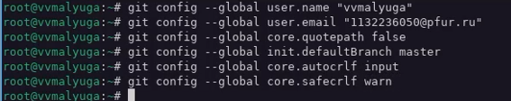{#fig:003 width=70%}

## Создание ключа SSH и PGP

  Создала ключи ssh по алгоритму rsa с ключём размером 4096 бит и по алгоритму ed25519 (рис. [-@fig:004]). Создала ключи pgp по предложенным опциям (рис. [-@fig:005]).  
  
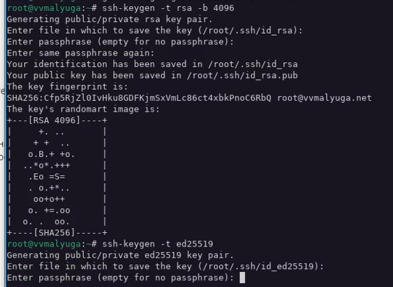{#fig:004 width=70%}

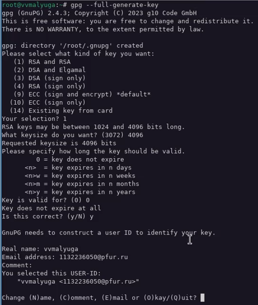{#fig:005 width=70%}

  Вывела список ключей (рис. [-@fig:006]), затем вывела gpg ключ (рис. [-@fig:007]). Скопировала его, и авторизовала в гитхабе (рис. [-@fig:008]).  

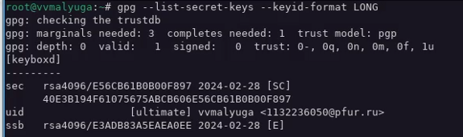{#fig:006 width=70%}

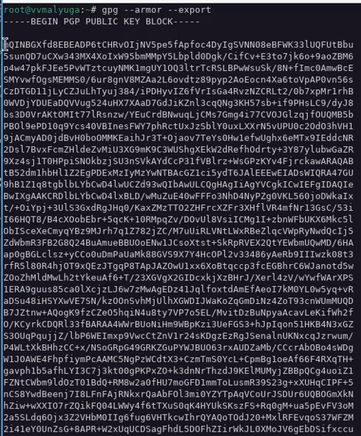{#fig:007 width=70%}

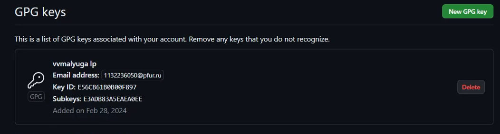{#fig:008 width=70%}

## Настройка подписи git

  Используя введёный email, указала Git применять его при подписи коммитов (рис. [-@fig:009]).  

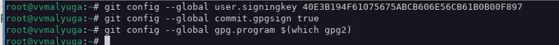{#fig:009 width=70%}

## Настройка gh 

  Авторизовала gh (рис. [-@fig:010]).  

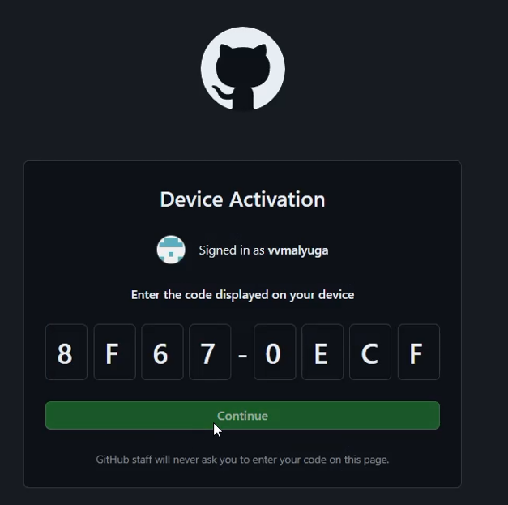{#fig:010 width=70%}

## Создание репозитория курса на основе шаблона

  Создала репозиторий курса на основе шаблона (рис. [-@fig:011]) и (рис. [-@fig:012]).  

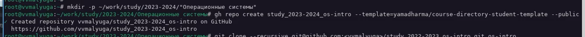{#fig:011 width=70%}

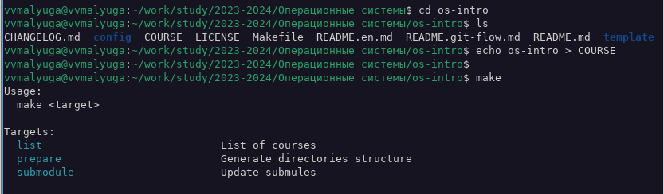{#fig:012 width=70%}
  
  Отправила файлы на сервер (рис. [-@fig:013]) и (рис. [-@fig:014]).  
  
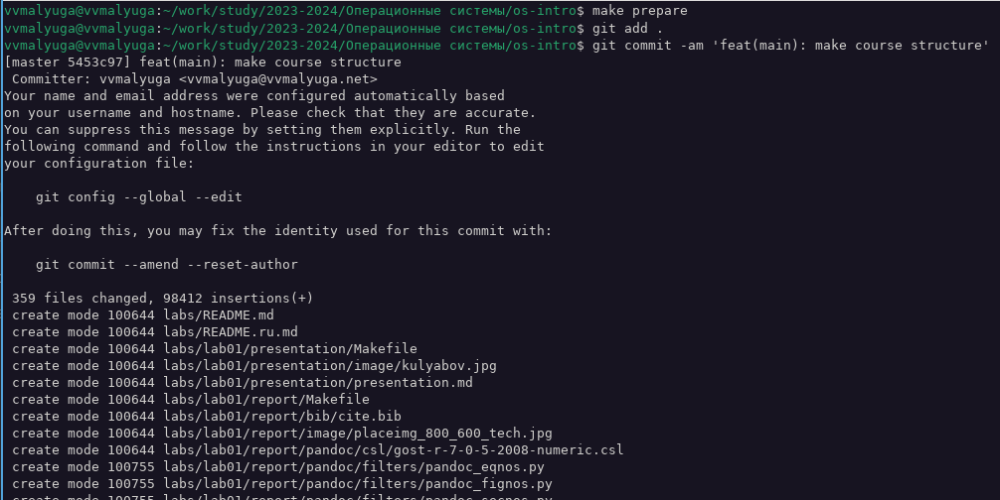{#fig:013 width=70%}  

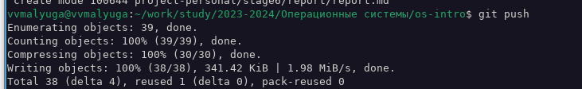{#fig:014 width=70%}

# Выводы

  Изучила идеологию и применение средств контроля версий, освоила умения по работе с git.
