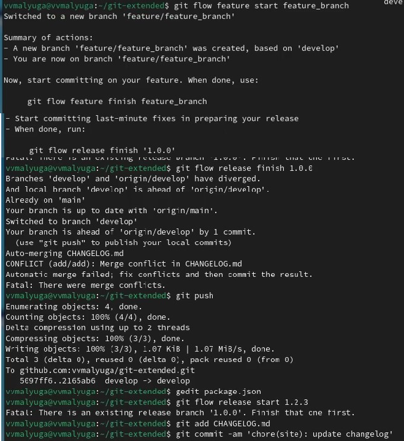

---
## Front matter
lang: ru-RU
title: Лабораторная работа №4
subtitle: Операционные системы
author:
  - Малюга В. В.
institute:
  - Российский университет дружбы народов, Москва, Россия
date: 9 марта 2024

## i18n babel
babel-lang: russian
babel-otherlangs: english

## Formatting pdf
toc: false
toc-title: Содержание
slide_level: 2
aspectratio: 169
section-titles: true
theme: metropolis
header-includes:
 - \metroset{progressbar=frametitle,sectionpage=progressbar,numbering=fraction}
 - '\makeatletter'
 - '\beamer@ignorenonframefalse'
 - '\makeatother'
---

## Цель работы

  Получение навыков правильной работы с репозиториями git.  

## Задание

1. Выполнить работу для тестового репозитория.  
2. Преобразовать рабочий репозиторий в репозиторий с git-flow и conventional commits.  

## Выполнение лабораторной работы. Установка git-flow

Установка git flow из коллекции репозиториев Copr (рис. 1).  
  
{#fig:001 width=70%}  

## Выполнение лабораторной работы. Установка Node.js

Установила nodejs и pnpm (рис. 2).  

{#fig:002 width=70%}  

## Выполнение лабораторной работы. Настройка Node.js

Для работы с Node.js добавила каталог с исполняемыми файлами, устанавливаемыми yarn, в переменную PATH. Запустила необходимую команду и перелогинилась (рис. 3).  

{#fig:003 width=70%}  

## Выполнение лабораторной работы. Общепринятые коммиты

Запустила программы, которые используются для помощи в форматировании коммитов и в создании логов (рис. 4).  

{#fig:004 width=70%}  

## Выполнение лабораторной работы. Общепринятые коммиты 

Создала репозиторий, сделала первый коммит и загрузила на гитхаб. Далее заполняю параметры пакета (рис. 5).  

{#fig:005 width=70%}  

## Выполнение лабораторной работы. Общепринятые коммиты

Добавила новые файлы, выполнила коммит, отправила на гитхаб (рис. 6).  

{#fig:006 width=70%}  

## Выполнение лабораторной работы. Общепринятые коммиты

Инициализировала git-flow. Префикс для ярлыков установила v. Загрузила весь репозиторий в хранилище. Установила внешнюю ветку как вышестоящую для этой ветки. Создала релиз с версией 1.0.0. Создала журнал изменений (рис. 7).  

{#fig:007 width=70%}  

## Выполнение лабораторной работы. Общепринятые коммиты

Создала ветку для новой функциональности. По окончании разработки новой функциональности следующим шагом следует объединить ветку. 
Создала релиз с версией 1.2.3. Обновила номер версии в файле package.json. Установила её в 1.2.3. Создала журнал изменений. Добавим журнал изменений в индекс. Залила релизную ветку в основную ветку. Отправила данные на github. Создала релиз на github с комментарием из журнала изменений (рис. 8).  

{#fig:008 width=70%}  

## Выводы

 Получила навыки правильной работы с репозиториями git. 
