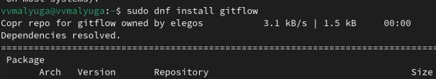
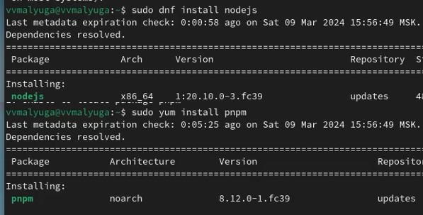
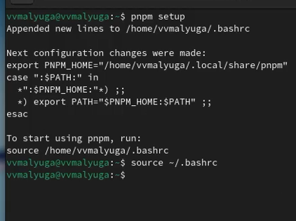
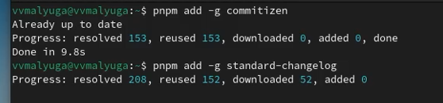
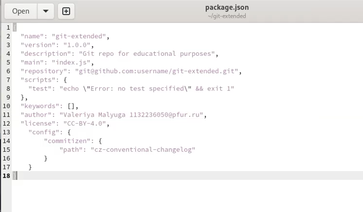
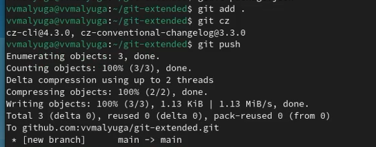
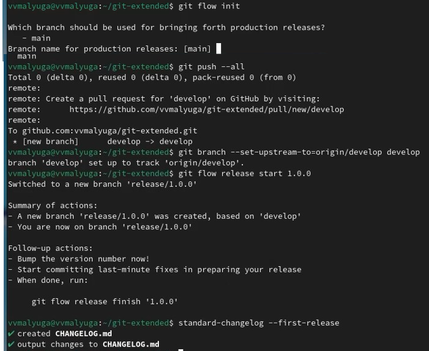
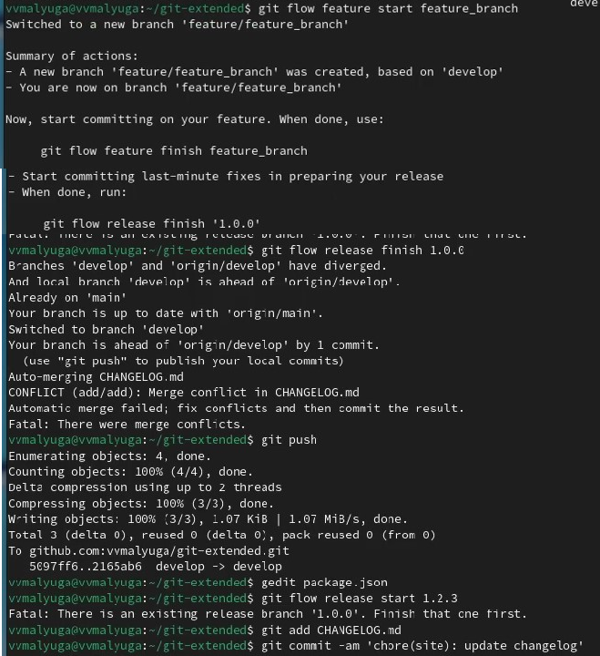

---
## Front matter
title: "Лабораторная работа №4"
subtitle: "Операционные системы"
author: "Малюга Валерия"

## Generic otions
lang: ru-RU
toc-title: "Содержание"

## Bibliography
bibliography: bib/cite.bib
csl: pandoc/csl/gost-r-7-0-5-2008-numeric.csl

## Pdf output format
toc: true # Table of contents
toc-depth: 2
lof: true # List of figures
lot: true # List of tables
fontsize: 12pt
linestretch: 1.5
papersize: a4
documentclass: scrreprt
## I18n polyglossia
polyglossia-lang:
  name: russian
  options:
	- spelling=modern
	- babelshorthands=true
polyglossia-otherlangs:
  name: english
## I18n babel
babel-lang: russian
babel-otherlangs: english
## Fonts
mainfont: PT Serif
romanfont: PT Serif
sansfont: PT Sans
monofont: PT Mono
mainfontoptions: Ligatures=TeX
romanfontoptions: Ligatures=TeX
sansfontoptions: Ligatures=TeX,Scale=MatchLowercase
monofontoptions: Scale=MatchLowercase,Scale=0.9
## Biblatex
biblatex: true
biblio-style: "gost-numeric"
biblatexoptions:
  - parentracker=true
  - backend=biber
  - hyperref=auto
  - language=auto
  - autolang=other*
  - citestyle=gost-numeric
## Pandoc-crossref LaTeX customization
figureTitle: "Рис."
tableTitle: "Таблица"
listingTitle: "Листинг"
lofTitle: "Список иллюстраций"
lotTitle: "Список таблиц"
lolTitle: "Листинги"
## Misc options
indent: true
header-includes:
  - \usepackage{indentfirst}
  - \usepackage{float} # keep figures where there are in the text
  - \floatplacement{figure}{H} # keep figures where there are in the text
---

# Цель работы

  Получение навыков правильной работы с репозиториями git.  

# Задание

1. Выполнить работу для тестового репозитория.  
2. Преобразовать рабочий репозиторий в репозиторий с git-flow и conventional commits.  

# Выполнение лабораторной работы

## Установка git-flow

Установка git flow из коллекции репозиториев Copr (рис. [-@fig:001]).  
  
{#fig:001 width=70%}  

## Установка Node.js

Установила nodejs и pnpm (рис. [-@fig:002]).  

{#fig:002 width=70%}  

## Настройка Node.js

Для работы с Node.js добавила каталог с исполняемыми файлами, устанавливаемыми yarn, в переменную PATH. Запустила необходимую команду и перелогинилась (рис. [-@fig:003]).  

{#fig:003 width=70%}  

## Общепринятые коммиты

Запустила программы, которые используются для помощи в форматировании коммитов и в создании логов (рис. [-@fig:004]).  

{#fig:004 width=70%}  

Создала репозиторий, сделала первый коммит и загрузила на гитхаб. Далее заполняю параметры пакета (рис. [-@fig:005]).  

{#fig:005 width=70%}  

Добавила новые файлы, выполнила коммит, отправила на гитхаб (рис. [-@fig:006]).  

{#fig:006 width=70%}  

Инициализировала git-flow. Префикс для ярлыков установила v. Проверила, что я на ветке develop. Загрузила весь репозиторий в хранилище. Установила внешнюю ветку как вышестоящую для этой ветки. Создала релиз с версией 1.0.0. Создала журнал изменений (рис. [-@fig:007]).  

{#fig:007 width=70%}  

Создала ветку для новой функциональности. По окончании разработки новой функциональности следующим шагом следует объединить ветку. 
Создала релиз с версией 1.2.3. Обновила номер версии в файле package.json. Установила её в 1.2.3. Создала журнал изменений. Добавим журнал изменений в индекс. Залила релизную ветку в основную ветку. Отправила данные на github. Создала релиз на github с комментарием из журнала изменений (рис. [-@fig:008]).  

{#fig:008 width=70%}  

# Выводы

 Получила навыки правильной работы с репозиториями git. 
